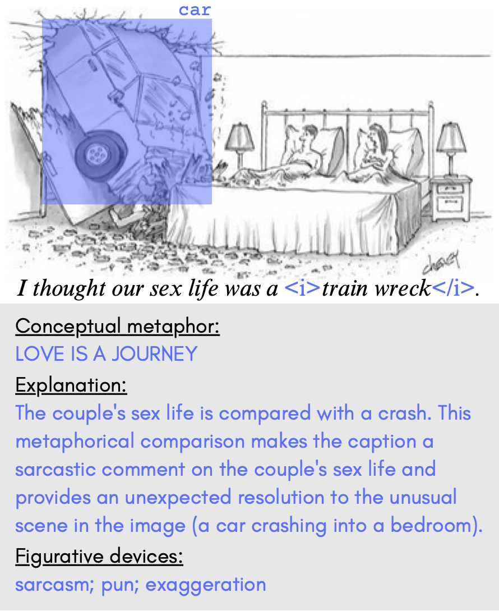

# [Hummus: A Dataset of Humorous Multimodal Metaphor Use](https://arxiv.org/abs/2504.02983)

  

The Hummus Dataset provides the following annotations for captioned New Yorker cartoons:
- Whether or not an image-text pair involves humorous multimodal metaphor use
- And if it does:
  - The conceptual metaphor underlying the humorous multimodal metaphor use
  - Image areas related to the conceptual metaphor (bounding box and label)
  - Caption parts related to the conceptual metaphor (surrounded by the \<i\> tag)
  - An explanation of how the metaphor use contributes to the humor
  - Any other figurative devices the image-text pair employs
